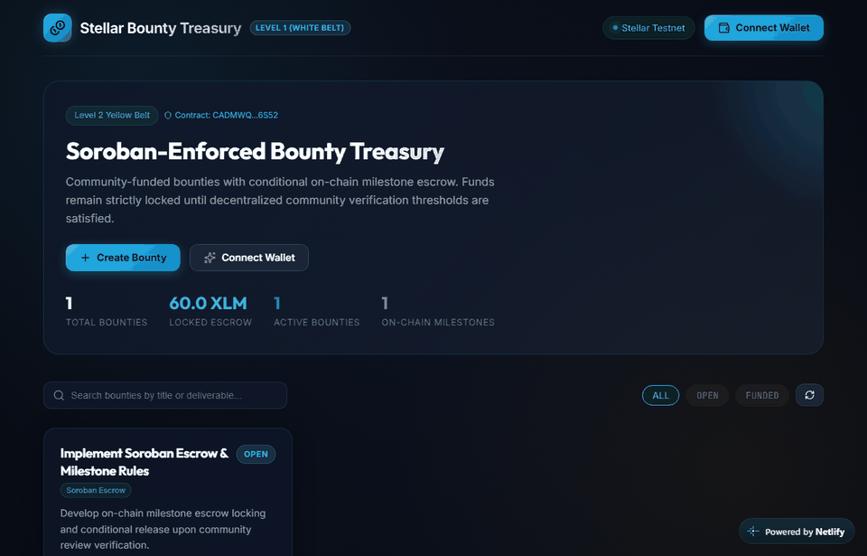

# ⚙️ Stellar Bounty Treasury — Backend API & Verifier

The backend service, persistent database, and on-chain Stellar Testnet transaction verification engine for **Stellar Bounty Treasury**.

**🌐 Live Frontend Application**: [https://stellar-bounty-treasury-2676.netlify.app](https://stellar-bounty-treasury-2676.netlify.app)

---

## 📌 What It Does — Level 2 (Yellow Belt)

At **Level 2**, this backend acts as the authoritative off-chain indexing and observation layer for the **Soroban Smart Contract**:

* **Contract Integration**: Integrates directly with deployed Soroban bounty contract `CADMWQPCCQP27UHQU4JG3C6V5I3UFNNC4DVOMSK2GUJFA6Q2PNW36S52` on Stellar Testnet.
* **Event Indexing Engine**: Ingests structured Soroban contract events (`bounty_created`, `bounty_funded`, `milestone_submitted`, `milestone_approved`, `milestone_paid`).
* **Strict Idempotency**: Guarantees zero duplicate event persistence using cryptographic event deduplication keys (`event_key`).
* **Milestone Lifecycle Management**: Exposes milestones, submission evidence links, reviewer verifications, and conditional settlement states.
* **State Reconciliation**: Reconciles indexed database records against authoritative on-chain contract state.

> **Architectural Rule**: The contract enforces. The backend observes. The frontend orchestrates. The backend never moves funds on behalf of users.

---

## 🏛️ Architecture & Extensibility

```text
stellar-bounty-backend/
├── src/
│   ├── config.ts               # Environment variables & Soroban RPC / Contract ID
│   ├── app.ts                  # Express server, middleware, error handling
│   ├── server.ts               # Server bootstrap & lifecycle listeners
│   ├── db/
│   │   └── database.ts         # SQLite schema (bounties, milestones, verifications, contract_events)
│   ├── services/
│   │   ├── stellar.ts          # Stellar Testnet Horizon verification service
│   │   ├── eventIndexer.ts     # Idempotent contract event ingestor & reconciler
│   │   └── bountyService.ts    # Level 2 business logic, milestone transitions, verifications
│   ├── controllers/
│   │   └── bountyController.ts # HTTP request/response handlers
│   └── routes/
│       └── bountyRoutes.ts     # Express router definition
├── tests/
│   └── bounties.test.ts        # Comprehensive test suite with Vitest (15 tests passing)
├── .env.example
├── tsconfig.json
└── package.json
```

---

## 🚀 How to Run It

### Installation

```bash
npm install
```

### Development Mode

```bash
npm run dev
```

The server listens on `http://localhost:5000`.

### Production Build & Run

```bash
npm run build
npm start
```

### Running Test Suite

```bash
npm test
```

---

## ⚙️ Required Environment Variables

Create `.env` based on `.env.example`:

```bash
PORT=5000
NODE_ENV=development
CORS_ORIGIN=*
DATABASE_PATH=./data/treasury.db

# Stellar & Soroban Testnet
STELLAR_NETWORK=TESTNET
HORIZON_URL=https://horizon-testnet.stellar.org
SOROBAN_RPC_URL=https://soroban-testnet.stellar.org
SOROBAN_CONTRACT_ID=CADMWQPCCQP27UHQU4JG3C6V5I3UFNNC4DVOMSK2GUJFA6Q2PNW36S52
STELLAR_PASSPHRASE="Test SDF Network ; September 2015"
```

---

## 📡 API Reference — Level 2 Endpoints

| Method | Endpoint | Description |
|---|---|---|
| `GET` | `/health` | Service health status, database, and contract address |
| `GET` | `/api/bounties` | List all bounties with milestone counts and metrics |
| `GET` | `/api/bounties/:id` | Get bounty details including milestones, contributions, events |
| `POST` | `/api/bounties` | Create a new bounty |
| `POST` | `/api/bounties/:id/milestones` | Create a milestone for a bounty |
| `GET` | `/api/bounties/:id/milestones` | List all milestones belonging to a bounty |
| `GET` | `/api/milestones/:id` | Get milestone details by ID |
| `POST` | `/api/milestones/:id/submit` | Submit evidence reference for milestone review |
| `POST` | `/api/milestones/:id/verify` | Submit reviewer vote (`approve` or `reject`) |
| `GET` | `/api/milestones/:id/verifications` | List community verification votes for a milestone |
| `POST` | `/api/milestones/:id/release-payment`| Trigger/record milestone payout release |
| `GET` | `/api/bounties/:id/contributions` | List on-chain contributions for a bounty |
| `GET` | `/api/bounties/:id/events` | List indexed Soroban contract events for a bounty |
| `POST` | `/api/events/ingest` | Process incoming contract event (idempotent deduplication) |
| `POST` | `/api/bounties/:id/reconcile` | Reconcile indexed database state with on-chain Soroban state |

---

## 🔒 Security & Deduplication

1. **Idempotent Ingestion**: `eventIndexer` uses a unique `event_key` constraint on `contract_events`. Duplicate events are skipped automatically with zero double-counting.
2. **Reviewer Vote Protection**: `verifications` table enforces unique `(milestone_id, reviewer_address)` constraints. Duplicate voting attempts are rejected with HTTP 409 Conflict.
3. **Threshold Enforcement**: Payment release is strictly rejected until milestone approvals meet or exceed `approval_threshold`.

---

## 📸 Level 2 Evidence & Demonstration

### 1. Level 2 On-Chain Bounty Dashboard & Soroban Escrow
The dashboard displays bounties with live milestone progress indicators (`1 / 1 complete`), locked Soroban contract escrow balances, and direct links to the deployed contract on Stellar Expert (`CADMWQPCCQP27UHQU4JG3C6V5I3UFNNC4DVOMSK2GUJFA6Q2PNW36S52`).


### 2. Milestone Deliverable Review & Community Approval
Demonstrating the live deliverable submission (`pull/2`), reviewer voting interface, and approval quorum verification directly recorded on-chain.


### 3. Live Demo Video: Milestone Voting & Conditional Release
Demonstrating the full Level 2 lifecycle: wallet connection, bounty creation, milestone submission with deliverable PR, multi-wallet community verification, threshold satisfaction, conditional payment unlock, and contract activity indexing.



* **Direct Video File**: [Download / View WebM Video (4.3 MB)](docs/evidence/level2_demo.webm)

---

## 🔄 How the Repository Evolves into Level 3

* **Level 3 Progression**:
  - SSE/WebSocket realtime event streaming.
  - Multi-recipient milestone payout splitting.
  - Settlement router oracles for automated dispute resolution.

---

## 📄 License

MIT

